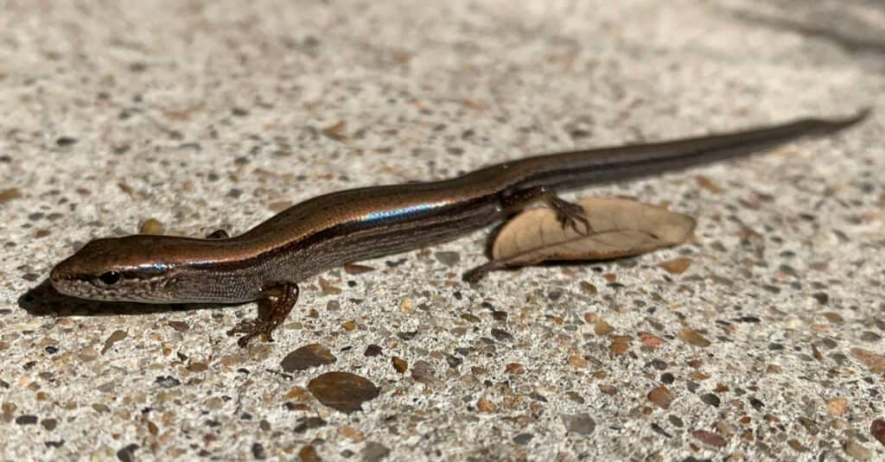

# lbs-renderer

A barebones renderer project to practice implementing rendering and physical simulation techniques with C++ and OpenGL.

The goal is to animate a little brown skink.

One of these guys.